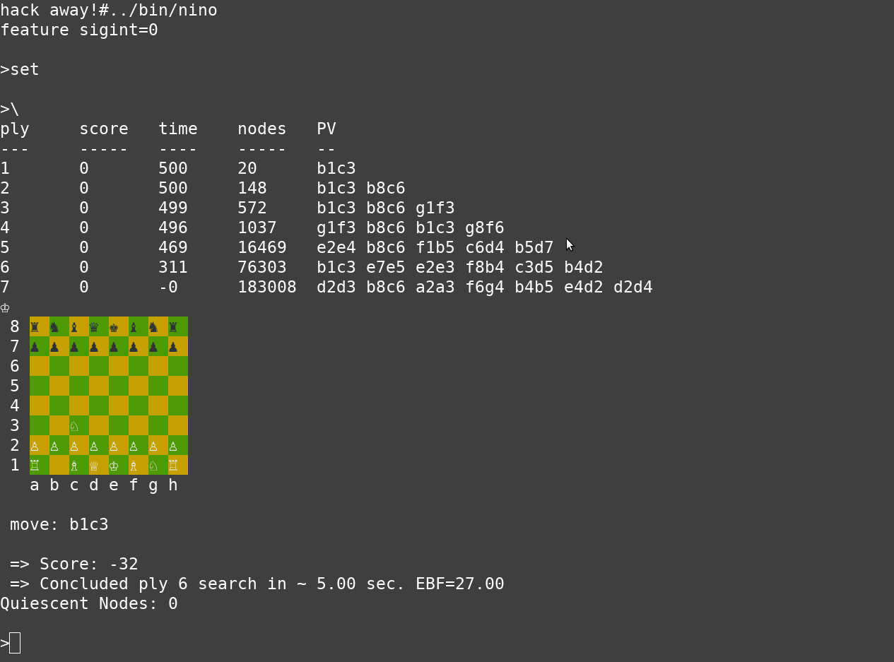
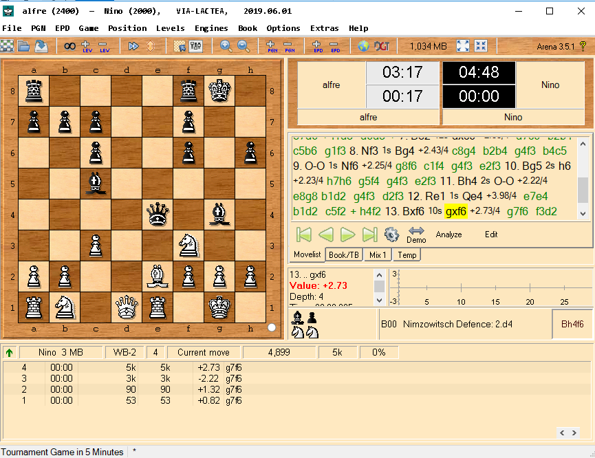

# Nino (Chess Engine)

Nino was my first 'serious' programming project.
I started to write it in my second year of university because I love chess ever since I was a kid, I had learned C and I wanted to challenge myself.

Found it laying around and decided to dust it off and post it.

It partially implements the [CECP](http://hgm.nubati.net/CECP.html) protocol so it has been tested with XBoard, WinBoard and Arena on Windows.


## Build

Just use make under linux/windows or use the compile.bat script.

```bash
$ cd src
$ make
```

## Usage

`=` or `set` Sets the board to the initial state

`/` or `boardinfo` prints the current state of the board and other information

`xxxx` An algebraic notation chess move (a-h)(1-8)(a-h)(1-8). It just makes that move on the board

`; n` , `play n` or `search n` starts the chess engine to find a move using a max ply of n

`\ n` or `think n` start the chess engine to run for n seconds reaching the maximum ply posible. If no n is supplied default time to think is 5 seconds.

`-` or `undo` Undo the last move

`fen` Prints the fen notation string for the position

`clear` clears the terminal

`debug` Turn debug mode on

`perft n` to run a performance test with a n ply depth

`epdtest file` Read file (an epd file) and does a performance with the test file supplied

`exit`, `bye` or `quit` to exit the program

`eval` Evaluates position and outputs the result

`h` or `hash` Outputs the hash for the position

`see sq` Evaluates SEE for the sq (0-63) Square 

`,` or `moves` Show all available moves

`<` or `captures` Generates and outputs all captures

`attacked` Prints a Board with all atacked squares

`+escape` Generates and outputs moves that escape from check

`order` Orders available moves (according to some heuristic I can't remember) and outputs them

## Warning

The code is EXTREMELY messy and dirty ... and I really don't care to clean it up at this stage. Maybe later :/

It helped me understand lots of new concepts regarding the C language, data structures, algorithms, game theory, multithreading, and even chess (which I have been playing since 8, reading theory books and participating on tournaments).

The chess engine is named after my cat nino. It's alive and well after 12 years.

## Things I learned and implemented

* [Chess Engine Comunication Protocol](http://hgm.nubati.net/CECP.html)
* [Bit Twidiling](http://graphics.stanford.edu/~seander/bithacks.html)
* [Bitboards](https://en.wikipedia.org/wiki/Bitboard)
* [Minimax algorithm](https://en.wikipedia.org/wiki/Minimax#Minimax_algorithm_with_alternate_moves)
* [Alpha Beta Prunning](https://en.wikipedia.org/wiki/Alpha%E2%80%93beta_pruning)
* [Pthreads](https://en.wikipedia.org/wiki/POSIX_Threads)
* [Iterative deepening](https://en.wikipedia.org/wiki/Iterative_deepening_depth-first_search)
* [Quiescence Search](https://en.wikipedia.org/wiki/Quiescence_search)
* [Hashing, Trasposition tables](https://en.wikipedia.org/wiki/Transposition_table) (Yes I wrote a really dumb hashing function)
* [FEN parsing](https://en.wikipedia.org/wiki/Forsyth%E2%80%93Edwards_Notation)

## Screenshots

Linux terminal mode



Executing on Arena for windows




## License

yes
